# Installing Cygwin to use SQLite3
John Bemis

Joel Lechman

Logan Davis 

&nbsp;

## Introduction:
This tutorial is for those who would like to set up and use a Linux environment on Windows, as well as set up and use SQLite3 in said environment. In order to be successful with this tutorial, an understanding of the command line, as well as basic computer concepts such as downloading and installing programs is required. It is suggested to use SQLite3 with Cygwin as opposed to the Windows command prompt because Cygwin provides a cleaner workflow with in-terminal editors such as Nano and Vim.

___
## Part one - Installing Cygwin:
Intro: 
From the Cygwin site: "a large collection of GNU and Open Source tools which provide functionality similar to a Linux distribution on Windows." Instead of installing an entire Linux distribution and dual booting on my dinky computer, Cygwin is an easy way to use some Linux packages as well as perform some Linux bash commands. There are other similar Linux-esque simulators for Windows that are available without downloading entire distributions, however, Cygwin has been in development for much longer than the others, and is much more supported.  

1. Download Cygwin at www.cygwin.com. For a 32 bit > operating system, download the x86 version, for a > > 64 bit operating system, download the x64 version.

    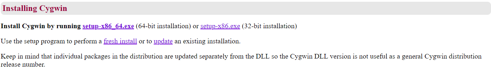

2. Run the installer, click next, and choose install > from internet when prompted.

    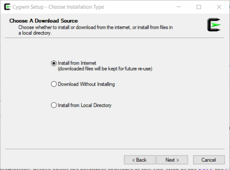

 3. When prompted, it is recommended that users save  the root install in the top directory of your drive.
 *It is recommended that users don’t change this because it creates a new home directory wherever this is installed. Cygwin will open to your new home every time it is started, and it is easiest to navigate if the root is here.*

    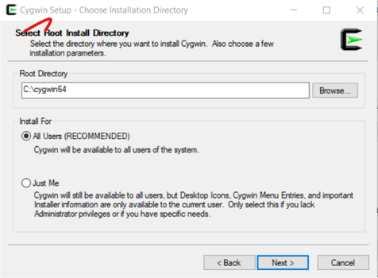
 

4. When prompted to choose a folder for the local package directory, hit next to use the default location. Note: This folder will only be holding the temporary files that will be used for the installation. The actual packages that are installed by Cygwin can be found in the user's binary folder "C:\cygwin64\bin", so the default location for this folder is fine. 

5. When prompted to select your internet connection type, select the appropriate type and hit next. Select "Use System Proxy Settings" if unsure of your connection type. (This selection will work for most normal network connections.)

6. When prompted to choose a download site, select the top address as any of them will do.

7. When prompted to select packages to install, use the search bar to find “lynx”.

8. Multiple entries for "lynx" should show up. Click 'Skip' next to the entry that has the "web" tag under the category header. A version number will appear for that entry.

    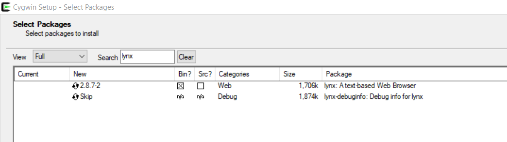

9. Use the search bar to find "wget"

10. As with the previous package: Click 'Skip' next to the entry that has the "web" tag under the category header. Again, a version number will appear for that entry.

    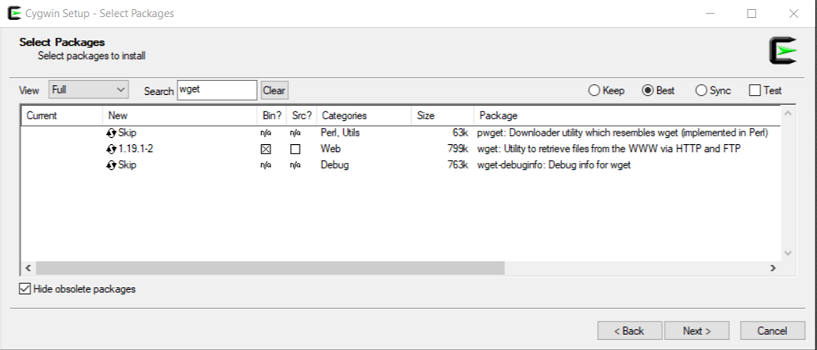

11. Click next at the bottom right to continue & click next again to confirm the installation of the two packages.

13. Once the downloads finish, complete the setup by selecting your desktop shortcut preferences, and then hit finish. After the installation program closes, start Cygwin. The window that shows up should look like the image below.

    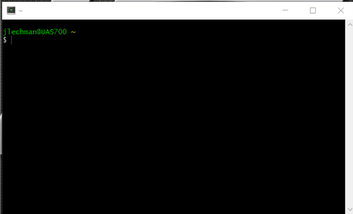

___
## Part two - Installing APT-CYG:
Intro: apt-cyg is a package manager similar to apt-get, rpm, or yum from Linux. 

1. Copy and paste this line into your Cygwin terminal:

         lynx -source rawgit.com/transcode-open/apt-cyg/master/apt-cyg > apt-cyg

    *Note: To verify this command ran correctly. Input "ls" and hit enter. "apt-cyg" should appear in the output.* 
    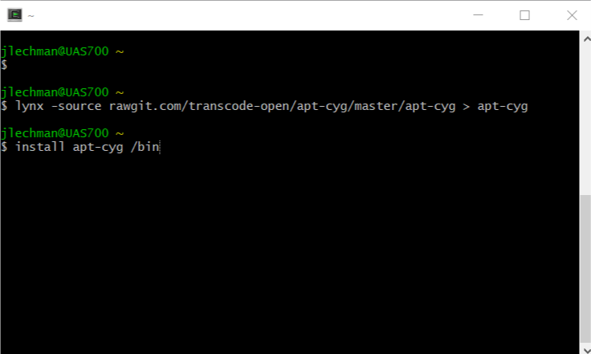

 
2. Type the following command into the Cygwin terminal:

        install apt-cyg /bin

3. Test your apt-cyg install by typing:

        apt-cyg install nano
	
    *Note: nano is simply a text editor, and there are other options available. Feel free to use whatever text editor you are most comfortable with.*

4. To determine if apt-cyg has been installed correctly verify that the terminal displays “Package nano installed" at the bottom of the output.

    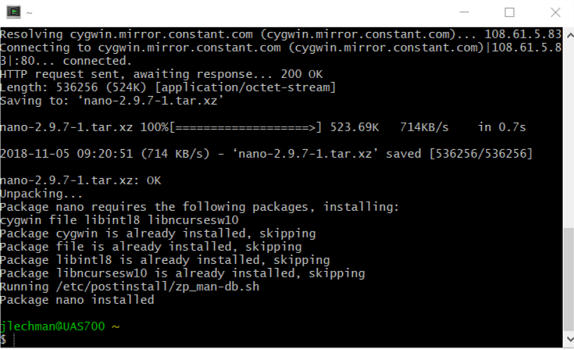

*Note: If the user runs into the error "Permission Denied," run Cygwin as the Administrator*

___
## Part three - Sqlite3:

1. SQLite3 can be ran straight from Cygwin, making query-writing a breeze. In the Cygwin terminal, type:

        apt-cyg install sqlite3

2. A successful install will show “Package sqlite3 installed” at the bottom of the output. 

    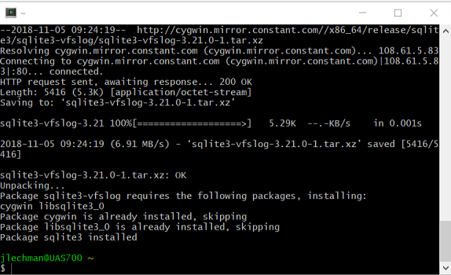

3. SQLite3 can be ran simply by typing in the command: 

        sqlite3
If your terminal looks like the image below, SQLite3 is running.

 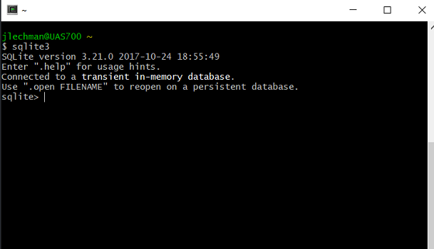

___
## Part four - Basic SQL:

<a href="https://bitbucket.org/lechman_davis_bemis/databases-writing-project/src/master/writing/02-tutorial/files/sampleData.sql" download>Click to view the sampleData.sql file</a>

*If the file is not available for download, copy the file and paste it into a blank text document. Save the file as sampleData.sql*

1. Before launching SQLite3, make sure that the current directory in Cygwin is in the same directory as the .sql file. Now, with SQLite3 open and running, is it possible to perform a few basic SQL operations which include SELECT, UPDATE, and DELETE. First, lets read in the sample data provided by running the following command:

    .read sampleData.sql
    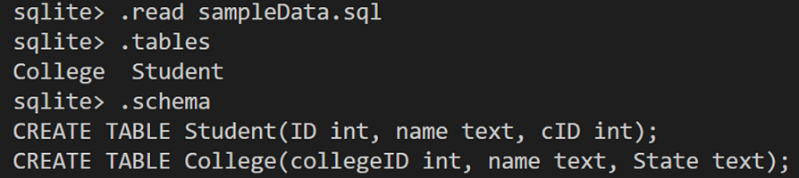
	

2. Lets begin with simple SELECT statements. SELECT statements acquire information from a given table and displays it as output. Specific columns can be selected by providing the column name(s), or select the entire table with the * character.

    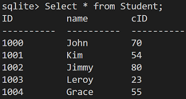
    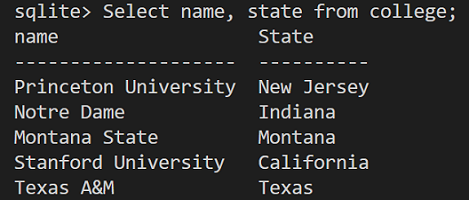

3. The next statement is UPDATE. UPDATE in SQL allows modification of a currently existing tuple with the information inputted. A "tuple" is one row of the table, or one instance of all the entries in a column, as well as its attributes. Referencing the picture below, one example of a tuple is <1002, Jimmy, 80>. In this example, lets change “John” to “Troy” in the student table.

    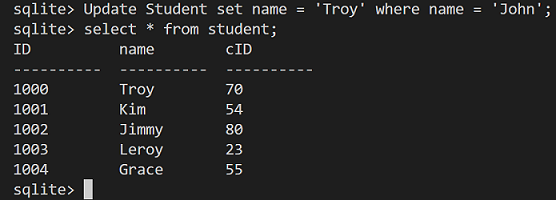

4. DELETE statement in SQL is used to delete an entire tuple based off of a condition. In this example lets delete the tuple where the name “Grace” appears in the student table. 

    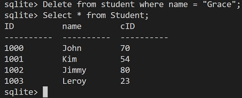

5. Lastly, it is possible to combine tables within a SELECT statement and display information from both tables at once. The syntax must include a column header from two separate tables and must be called from both tables. The two different tables must be linked with a column shared between the two. 
For example, it is possible to link the following query by *cID* from student and *collegeID* from College:

    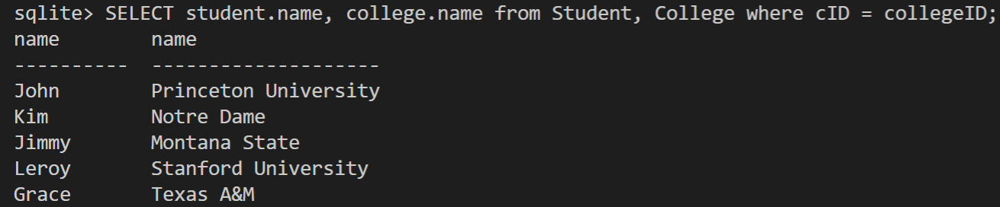
    

___
### A problem to practice with
What is the name and school for every student? Display the Student name, Student cID,   	College Name and the College ID.

Answer:
    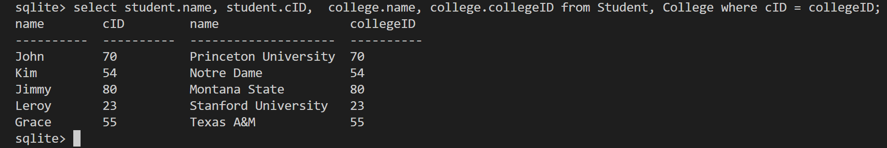

___
## Troubleshooting:

* If the Cygwin installer seems to not be working correctly or as it should, a fresh restart of the computer is always a good idea. Some programs like antivirus software might block installers. 
* If no packages show up when installing Cygwin in the “Select Packages” screen, make sure that “View:” is set to “Full.”
* When running some commands, Cygwin will not give error messages. Make sure that commands are typed in correctly. (Hint: sqlite3 has one “L.”)
* Note: SQLite3 is not case-sensitive, however Cygwin is.

